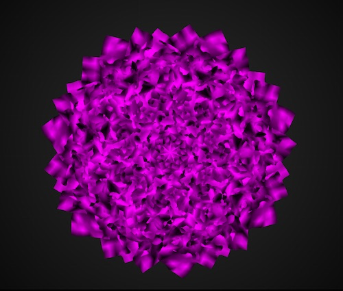
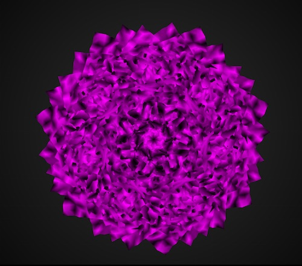
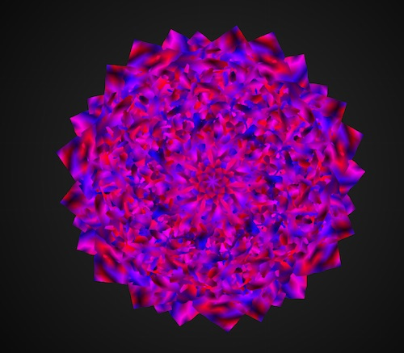
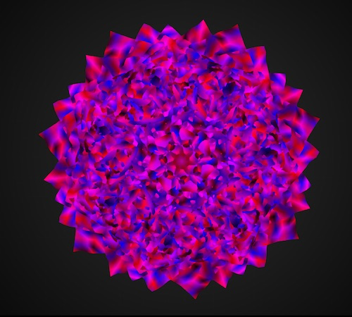

## Working with meshes and Perlin noise
This project explores the use of ofMesh, ofNoise, and ofSignedNoise. Specifically, it has an array of meshes that are each rotated 70 degrees to create a flower-like object. The movement is generated by ofNoise and the colors are generated by using red and blue values multiplied by different values of ofSignedNoise. 

Below is what the program looks like when not as much pure red and blue are used:

And here is what the program looks like when more red and blue are used:

